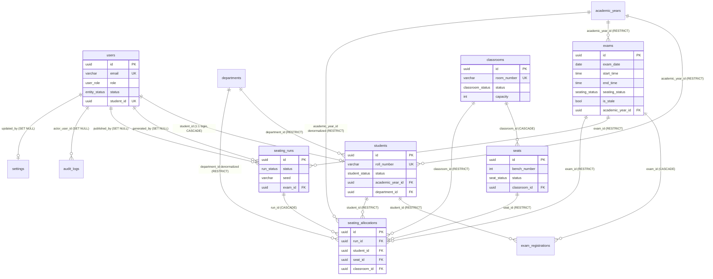

# ER Diagram

College Exam Seating Management System — PostgreSQL 16 schema (snake_case tables).
Column-level reference: [`SCHEMA.md`](./SCHEMA.md). Source of truth: `backend/prisma/schema.prisma`
plus raw SQL migrations in `backend/prisma/migrations/`.

## Diagram

## Every relationship

| Parent → Child | FK column (child) | On delete | Why |
|---|---|---|---|
| `students` → `users` | `users.student_id` (UNIQUE) | **CASCADE** | A student login exists only for its student; removing the student removes the login. The 1:1 link lives on `users` so `students` stays free of circular FKs. |
| `academic_years` → `students` | `students.academic_year_id` | **RESTRICT** | History-bearing: students cannot vanish while referenced; the UI deactivates instead. |
| `departments` → `students` | `students.department_id` | **RESTRICT** | Same — "cannot delete if students reference them, deactivate instead" (guide §6/Phase 4). |
| `students` → `exam_registrations` | `exam_registrations.student_id` | **RESTRICT** | Registration history must survive. |
| `exams` → `exam_registrations` | `exam_registrations.exam_id` | **CASCADE** | Registrations are part of the exam; deleting an exam without a seating plan removes them. |
| `academic_years` → `exams` | `exams.academic_year_id` | **RESTRICT** | An exam is "one academic year"; the year must exist while exams do. |
| `classrooms` → `seats` | `seats.classroom_id` | **CASCADE** | Benches only make sense inside their room; deleting an unused room removes its benches. Rooms with allocations are protected one level up (see below). |
| `exams` → `seating_runs` | `seating_runs.exam_id` | **RESTRICT** | Seating history is never orphaned: an exam with runs cannot be deleted (the immutability trigger additionally blocks touching *published* runs). |
| `users` → `seating_runs` | `seating_runs.generated_by`, `published_by` | **SET NULL** | Actor attribution is best-effort history; deleting a user must not block run lifecycle. |
| `seating_runs` → `seating_allocations` | `seating_allocations.run_id` | **CASCADE** | An allocation is meaningless without its run (superseded/failed runs are *kept*, not deleted — the partial unique index handles "active run" semantics). |
| `exams` → `seating_allocations` | `seating_allocations.exam_id` | **RESTRICT** | Denormalized for fast history/export queries; keeps exam ↔ allocation consistency. |
| `students` → `seating_allocations` | `seating_allocations.student_id` | **RESTRICT** | Hard constraint history: who sat where must remain auditable. |
| `classrooms` → `seating_allocations` | `seating_allocations.classroom_id` | **RESTRICT** | Indirectly protects rooms from deletion once they have seating history ("mark unavailable instead"). |
| `seats` → `seating_allocations` | `seating_allocations.seat_id` | **RESTRICT** | A bench with history cannot be dropped silently. |
| `academic_years` → `seating_allocations` | `seating_allocations.academic_year_id` | **RESTRICT** | Denormalized for history queries/exports (guide §5). |
| `departments` → `seating_allocations` | `seating_allocations.department_id` | **RESTRICT** | Denormalized for history queries/exports. |
| `users` → `audit_logs` | `audit_logs.actor_user_id` | **SET NULL** | The audit trail itself must survive user deletion. |
| `users` → `settings` | `settings.updated_by` | **SET NULL** | Attribution only. |

## Keys, constraints and indexes

### Primary keys
Every table: `id uuid PRIMARY KEY DEFAULT gen_random_uuid()` (generated by Prisma `@default(uuid())`).

### Unique constraints
| Constraint | Table | Purpose (spec reference) |
|---|---|---|
| `users_email_key` | users | Login identifier (nullable — a student login may use roll number only) |
| `users_student_id_key` | users | **1:1** student ↔ login (guide §5) |
| `academic_years_name_key`, `academic_years_code_key` | academic_years | Configurable master data without duplicates |
| `departments_code_key` | departments | Department code uniqueness |
| `students_roll_number_key` | students | "unique roll_number" (guide §5); plus `CHECK (btrim(roll_number) <> '')` |
| `classrooms_room_number_key` | classrooms | "unique room_number" (guide §5) |
| **`seats_classroom_id_bench_number_key`** | seats | "`(classroom_id, bench_number)` unique" (guide §5) — also serves as the required `seats (classroom_id)` index |
| **`exam_registrations_exam_id_student_id_key`** | exam_registrations | Hard constraint 7 (one registration per student per exam) |
| **`seating_allocations_run_id_student_id_key`** | seating_allocations | Hard constraint 7: "no duplicate student" per run |
| **`seating_allocations_run_id_seat_id_key`** | seating_allocations | Hard constraint 7: "no duplicate seat" per run |
| `settings_key_key` | settings | One row per setting |
| **`seating_runs_one_active_per_exam`** (partial) | seating_runs | **Partial unique index**: `UNIQUE (exam_id) WHERE status NOT IN ('SUPERSEDED','FAILED')` — only one active run per exam (guide §5) |

### CHECK constraints (raw SQL migration `constraints_and_triggers`)
| Constraint | Rule |
|---|---|
| `exams_end_time_after_start_time` | `end_time > start_time` (guide §5, hard) |
| `seats_bench_number_positive` | `bench_number > 0` |
| `classrooms_capacity_non_negative` | `capacity >= 0` |
| `students_roll_number_not_blank` | `btrim(roll_number) <> ''` |
| `classrooms_room_number_not_blank` | `btrim(room_number) <> ''` |

Enum-like checks are native Postgres **enum types**: `user_role`, `entity_status`,
`student_status`, `classroom_status`, `seat_status`, `exam_status`, `seating_status`,
`registration_status`, `run_status` — invalid values fail with SQLSTATE `22P02`.

### Secondary indexes (guide §5)
| Index | Columns | Serves |
|---|---|---|
| `students_academic_year_id_department_id_status_idx` | (academic_year_id, department_id, status) | Eligibility queries |
| `students_department_id_idx` | (department_id) | Per-department listings |
| `students_status_idx` | (status) | Active filtering |
| `academic_years_status_idx`, `departments_status_idx`, `classrooms_status_idx` | (status) | Master-data filters |
| `exams_academic_year_id_idx`, `exams_exam_date_idx` | (academic_year_id), (exam_date) | Exam listings/schedule |
| `exam_registrations_student_id_idx` | (student_id) | Reverse lookup (composite unique covers `(exam_id, …)`) |
| `seating_runs_exam_id_idx`, `seating_runs_status_idx` | (exam_id), (status) | Run history (partial index covers active-run lookups only) |
| `seating_allocations_student_id_idx` | (student_id) | Student seating history (composite uniques cover `(run_id, …)`) |
| `seating_allocations_exam_id_idx` | (exam_id) | Per-exam plan queries/exports |
| `seating_allocations_classroom_id_idx` | (classroom_id) | Room-wise seating lists |
| `audit_logs_created_at_idx` | (created_at) | Chronological audit reads |
| `audit_logs_entity_type_entity_id_idx` | (entity_type, entity_id) | Per-entity history |

### Triggers (raw SQL migration `constraints_and_triggers`)
| Trigger | Table(s) | Behaviour |
|---|---|---|
| `trg_seat_belongs_to_classroom` | seating_allocations (INSERT, UPDATE OF seat_id, classroom_id) | Fails (SQLSTATE `23514`) unless the row's `seat_id` really belongs to the row's `classroom_id` — *seat-belongs-to-room integrity* (guide §5). |
| `trg_runs_published_immutable` | seating_runs (UPDATE, DELETE) | Rejects (SQLSTATE `42501`) any UPDATE/DELETE while `status = 'PUBLISHED'`. |
| `trg_allocations_published_immutable` | seating_allocations (INSERT, UPDATE, DELETE) | Rejects any change while the parent run is `PUBLISHED` — enforces *published arrangements are immutable* (hard constraint 8) at the database level. |
| `trg_refresh_classroom_capacity` | seats (INSERT, UPDATE, DELETE) | Recomputes `classrooms.capacity = count(seats WHERE status='AVAILABLE')`, keeping the "capacity = available benches" rule true even for raw SQL. |

**Controlled bypass:** `SELECT allow_published_mutation()` sets the
transaction-local flag `app.allow_published_mutation` (`set_config(..., is_local => true)`).
Only the Super Admin unpublish flow calls it, inside one transaction; the flag can never
leak into another transaction. Service-level guards (Phase 7) still require role + reason.

## Schema evolution rules
- Schema changes go through `prisma migrate dev --create-only` → hand-written SQL appended → applied.
  Never edit an already-applied migration (checksums are recorded in `_prisma_migrations`).
- Verify any time with a clean database: `npx prisma migrate deploy` (acceptance of Phase 2).
