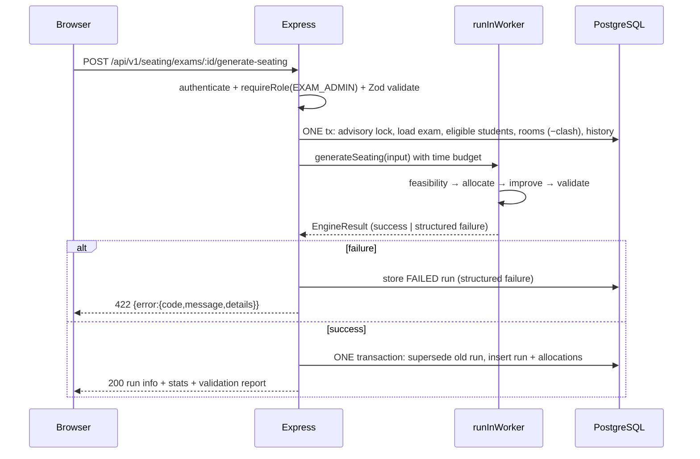

# Architecture

College Exam Seating Management System — internal admin tool with a constraint-aware seating
allocation engine. This document explains the chosen stack (and why alternatives were rejected),
the runtime architecture, the module map, and the real-time/background-processing decision.

## 1. Technology stack

| Layer | Choice | Why |
|---|---|---|
| Frontend | React 18 + Vite + TypeScript, Tailwind CSS, shadcn/ui-style components, React Router, TanStack Query, Recharts | Fast dev loop, no SSR complexity needed for an internal admin tool, very well documented |
| Backend | Node.js 20 + Express + TypeScript, modular folders | Same language as the frontend, simple, widely known, easy to deploy |
| Database | PostgreSQL 16 | Strong integrity (FKs, CHECK constraints, partial unique indexes, triggers, transactions) |
| ORM / migrations | Prisma + raw SQL migrations | Typed queries and clean migrations; raw SQL for triggers/CHECKs Prisma cannot express |
| Auth | JWT access token + refresh token in httpOnly cookie, argon2/bcrypt hashing, RBAC middleware | Standard and secure |
| Validation | Zod | Shared schemas, runtime safety, never trust the client |
| Import/Export | `csv-parse`, `exceljs`, `pdfkit`/`pdf-lib` | Pure JS, no external binaries |
| Testing | Vitest (unit/engine), Supertest (API), Playwright (UI smoke, optional) | One toolchain |
| Infra | Docker + docker-compose (postgres, backend, frontend) | One-command setup |
| Logging | pino | Structured JSON logs |

### Alternatives considered and why they were not chosen

| Alternative | Why not |
|---|---|
| **Next.js** (frontend) | SSR/RSC adds build and runtime complexity (server actions, caching layers) that buys nothing for an authenticated internal admin tool. Vite + SPA is simpler to run locally and deploy. |
| **NestJS** (backend) | Excellent framework, but its decorators/DI module system adds ceremony; a small team (and AI agents) move faster with plain Express + explicit modular folders. NestJS remains a straightforward future refactor if the codebase grows. |
| **FastAPI / Django** (backend) | Would split the project into two languages (Python + TS), losing shared types (Zod schemas ↔ TS frontend) and forcing a second toolchain. The algorithm is pure TypeScript anyway. |
| **Spring Boot** (backend) | JVM toolchain (Maven/Gradle, JVM memory footprint) is heavyweight for a locally-run, seconds-long-operation internal tool. |
| **MySQL** | Weaker constraint story than PostgreSQL: no partial unique indexes (needed: "only one active seating run per exam"), no `CHECK` enforcement history, no `JSONB` operators for audit metadata. Postgres also supports advisory locks (needed: prevent two simultaneous generations for one exam). |
| **Redis / message queue now** | Generation is a single seconds-long operation for one admin. A queue adds operational surface with no benefit at this scale (see §4). |

## 2. Runtime architecture

```mermaid
flowchart LR
    subgraph Browser
        UI[React SPA<br/>React Router · TanStack Query]
    end

    subgraph Docker Compose
        subgraph backend["backend (Node 20 + Express)"]
            API[REST API /api/v1<br/>Zod validation · RBAC middleware · audit log]
            W[(runInWorker<br/>seating engine runner)]
            ENG[Pure seating engine<br/>feasibility → greedy → local search → validate]
        end
        DB[(PostgreSQL 16)]
        FE[frontend (Vite dev server<br/>/api proxy → backend)]
    end

    UI -->|HTTP JSON| FE
    FE -->|proxy /api| API
    API -->|queries in one transaction| DB
    API -->|runGeneration examId, options| W
    W -->|structured result or structured failure| API
    ENG -.runs inside.-> W
```

Key properties:

- **The seating engine is pure**: `backend/src/engine/` imports no database, no Express, no Prisma.
  It takes an `EngineInput` and returns an `EngineResult`. This keeps it unit-testable and swappable.
- **The engine runs behind `runInWorker` (`src/engine/worker.ts`)** with a hard time budget
  (`timeBudgetMs`, default 5 s, max 60 s). Today the runner executes in-process; the seam exists so
  a `worker_threads` runner can be dropped in without touching the service (see ASSUMPTIONS #52).
- **All persistence goes through one DB transaction** per generation: previous draft superseded,
  run + allocations inserted atomically — never a partial plan.
- **Failures are structured**: `{code, message, details, suggestion}` (e.g. `INSUFFICIENT_SEATS`
  with "Additional seats required: 28"), never silent.

## 3. Module map

| Module (backend `src/modules/*`) | Responsibility | Phase |
|---|---|---|
| `health` | Liveness/readiness: DB ping, uptime | 1 |
| `auth` | Login, refresh rotation, logout, change-password, JWT issue/verify | 3 |
| `users` | Admin user CRUD (Super Admin only) | 3 |
| `audit` | `auditLog(actor, action, entity, entityId, metadata)` helper + `GET /audit-logs` | 3 |
| `departments`, `academic-years` | Configurable master data CRUD | 4 |
| `students` | CRUD, soft-deactivate, search/filter/pagination, CSV/XLSX import, student login users | 4 |
| `classrooms` | Room CRUD, bench generation, seat enable/disable | 4 |
| `exams` | Exam CRUD, auto-registration, eligible-students, preview stats, time-slot clash detection, registration status management | 5 |
| `seating` | generate/regenerate orchestration, engine runner call, one-transaction save, advisory-lock concurrency, publish/unpublish, stale-plan detection, run + student seating-history queries | 7 |
| `me` | Student-portal reads: `GET /me/seating` (PUBLISHED-only, upcoming/past split) and `GET /me/seating/slip/:examId` (pdfkit slip); STUDENT-role-only, keyed to the token's own student | 9 |
| `exports` | Exam-wise exports: classroom/department/student/plan (CSV/XLSX/PDF), single + bulk slips (PDF); draft watermark, published gate, structured 409. Classroom import (CSV/XLSX, dry-run, all-or-nothing, template download). | 10 |
| `dashboard` | Summary + chart data | 8 |

Frontend mirrors this with `src/pages` (routes), `src/features/*` (feature components),
`src/api` (typed client), `src/hooks` (TanStack Query hooks).

## 4. Synchronous request/response vs. real-time (Section 7 decision)

**Decision: synchronous HTTP request/response, engine behind the `runInWorker` seam (in-process today, `worker_threads` planned). No WebSockets, no SSE.**

Rationale:

- Generation is a single admin-initiated operation lasting seconds (budget: 10 s hard cap).
  WebSockets/SSE would add connection state, reconnection handling and infrastructure for one
  loading spinner — unjustified for a single-admin, seconds-long operation.
- The runner seam keeps the door open for a worker thread (or a queue) so the Express event loop
  stays responsive for larger cohorts — health checks, other API calls and the frontend's
  elapsed-time counter keep working while generation runs.
- The API contract stays job-ready: `runGeneration(examId, options) → result`. If allocations ever
  grow to tens of thousands of students, a queue (e.g. BullMQ + polling endpoint) can be slotted
  behind the same interface **without changing the engine**. This is a documented future option,
  not current scope.
- The frontend shows a loading state with an elapsed timer and is cancel-safe (a response for a
  cancelled request is simply discarded; the run still completes and is visible in run history).

## 5. Request lifecycle



## 6. Security baseline

- `helmet`, strict CORS allowlist, rate limiting (`express-rate-limit`), request-size limits.
- JWT access token short-lived; refresh token in httpOnly + SameSite cookie with rotation.
- Passwords hashed with bcrypt (cost ≥ 12) / argon2 — never logged, never returned.
- Zod validation on every input; RBAC middleware (`SUPER_ADMIN`, `EXAM_ADMIN`, `STUDENT`).
- `.env` never committed (`.env.example` documents every variable).
- Published seating plans are immutable at the API **and** database level (triggers) — **PUBLISHED runs/allocations only**. Non-PUBLISHED runs/allocations are freely deletable/updatable, and deletes return `OLD` so the `fn_enforce_published_immutability` trigger never silently swallows a row (DB-level deletes of DRAFT/VALIDATED/SUPERSEDED work). `app.allow_published_mutation` is a transaction-local bypass for the Super Admin unpublish flow.
